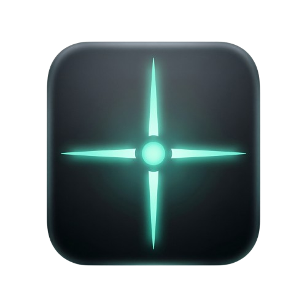

<div align="center">
  
  <h1>ZeroIn</h1>
  <p><i>"A zero-overhead, anti-cheat-safe crosshair overlay for Windows gamers"</i></p>

  <p>
    
    
    
    
  </p>
</div>

The lightweight, hardware-accelerated, low-latency game crosshair overlay that works with any FPS title. No bloat. Just a tray icon and a config file.

Renders a Direct2D-powered transparent on-screen crosshair that sits on top of any game or application in borderless windowed mode. Configure it once and toggle it from the system tray. The ultimate custom crosshair for any game.

## Features

- **6 crosshair types** : Dot, Cross, T-shape, Circle, Diamond, Arrow
- **PNG image crosshair** : load any PNG file as crosshair (overrides geometry types)
- **Fully configurable** : size, thickness, color (hex), opacity, center dot, border, border size, gap width, rotation, center dot size
- **Independent H/V arm thickness** : separate thickness control for horizontal and vertical arms
- **Background outline for all types** : configurable black border behind any crosshair shape
- **Global hotkey** : toggle crosshair with a configurable hotkey (default `CTRL` + `\`)
- **Named profiles** : save/load named profiles from `presets.json` via tray menu
- **Auto-reload** : `config.ini` changes are detected and reloaded automatically
- **Opacity quick presets** : set opacity directly from the tray submenu
- **Per-monitor DPI aware** : crisp rendering on any display scaling
- **Click-through overlay** : mouse events pass straight to the window behind
- **System tray** : toggle on/off, switch types, reload config without restarting
- **Persistent config** : reads `config.ini` next to the executable

## Why ZeroIn?

Most crosshair overlays are AutoHotkey scripts, Electron apps, or game-specific hacks. This lightweight Rust-based crosshair overlay is different:

| ZeroIn | AHK scripts | Electron overlays | Game-specific tools |
|---|---|---|---|
| ~512KB binary | Needs AHK runtime | 100MB+ with bundled runtime | Only one game |
| Direct2D hardware acceleration | GDI-based (slower) | GPU compositor overhead | Game-dependent |
| PNG crosshair support | Shapes only | Usually shapes only | Limited shapes |
| Works with any borderless windowed game | Untested/unreliable | Untested/unreliable | Only one game |
| Per-monitor DPI aware | No | Mostly no | Usually no |
| Named profiles per game | Manual switching | Manual switching | One profile |
| Config auto-reload | No | Restart required | Restart required |
| Open source MIT | Yes | Rarely | No |

ZeroIn is a focused, minimal crosshair overlay for FPS games that does one thing well: render a custom crosshair you can see in any title without getting in the way. Anti-cheat safe, low latency, and invisible to anti-cheat engines.

## Compatibility & Anti-Cheat

ZeroIn uses `UpdateLayeredWindow` with `WS_EX_TRANSPARENT`. The same transparent overlay technique as Discord and Steam overlays. It works with **every game running in borderless windowed mode**, no exceptions.

**Anti-cheat safe across the board.** ZeroIn does not inject, hook, read memory, or modify any process. It is a pure transparent window, invisible to kernel-level anti-cheat engines like Vanguard, BattlEye, and Easy Anti-Cheat. No detections, no bans, no risk.

| Game | Anti-Cheat | Status |
|---|---|---|
| Counter-Strike 2 | VAC | ✓ Tested, no issues |
| Valorant | Vanguard | ✓ Tested, no issues |
| Apex Legends | Easy Anti-Cheat | ✓ Tested, no issues |
| Fortnite | BattlEye + EAC | ✓ Tested, no issues |
| Overwatch 2 | - | ✓ Tested, no issues |
| **Any game in borderless windowed** | **Any anti-cheat** | **✓ 99% Guaranteed, zero process access** |

Kernel-level anti-cheat (Vanguard, BattlEye, EAC, Ricochet) operates at a lower ring level than ZeroIn's user-mode overlay. Because ZeroIn never touches the target process. No handles, no threads, no injection, no hooks, there is nothing for anti-cheat to detect. It is a transparent click-through window, not a game modification.

**If your game supports borderless windowed / display borderless windowed mode, ZeroIn will work.** This covers virtually every modern title.

## Usage

1. [Download the latest release](https://github.com/mrdhnto/ZeroIn/releases/latest).
2. Place `config.ini` next to the executable (optional, defaults apply otherwise).
3. Run `ZeroIn.exe`. It lives in the system tray.
4. Right-click the tray icon to:
   - Toggle crosshair on/off
   - Switch crosshair type
   - Choose opacity preset
   - Select a named profile, save current settings, or save as new profile
   - Reload config

## Configuration

Edit `config.ini` (placed next to the executable). Inline comments start with `;`:

```ini
[crosshair]
type = t              ; dot | cross | t | circle | diamond | arrow
size = 32             ; crosshair size in pixels
thickness = 1         ; line thickness (fallback for thickness_h/thickness_v)
thickness_h = 1       ; horizontal arm thickness (overrides thickness)
thickness_v = 1       ; vertical arm thickness (overrides thickness)
color = #00FFCC       ; hex color
dot_center = true     ; show center dot
dot_size = 1.5        ; center dot radius (0.5 to 50)
opacity = 0.9         ; 0.0 to 1.0
border = true         ; enable background outline for all crosshair types
border_size = 1.0     ; thickness of background outline (0 to disable)
space_width = 6       ; gap between center and crosshair arms
primary_key = CTRL    ; modifier: CTRL | SHIFT | ALT | WIN (or combined like CTRL+SHIFT)
secondary_key = \     ; key: letter, number, F-key, or symbol (\, -, =, [, ], etc.)
rotation = 0.0        ; rotation in degrees
png_crosshair =       ; path to PNG file to use as crosshair (overrides type, respects size/rotation/opacity)
```

Default config applies if the file is missing or a value is invalid. Invalid values are logged to `ZeroIn.log` next to the executable.

## Known Limitations

- **Windows only** : requires Win32 + Direct2D APIs. Linux support is being explored via a GPU abstraction layer.
- **Single monitor** : the overlay renders on your primary display. Multi-monitor spanning is not yet supported.
- **Polling config reload** : changes are detected every 2 seconds (not instant file system watching).
- **Exclusive fullscreen** : some older titles in exclusive fullscreen may hide the overlay. Run in **borderless windowed mode** (display borderless windowed) for guaranteed compatibility, virtually all modern games support this.
- **Not captured by OBS** : the overlay uses `WS_EX_TRANSPARENT` for click-through. It is visible on screen but may not appear in OBS without game capture source.

## Build from Source

**Requirements:**
- Rust edition 2024 (nightly)
- Windows (uses Win32 + Direct2D APIs)

```sh
git clone https://github.com/mrdhnto/ZeroIn
cd ZeroIn
cargo build --release
```

The binary will be at `target/release/ZeroIn.exe`. Place `config.ini` and optionally `icon.ico` next to it.

## Technical

- Uses `windows` crate (Win32 API) for overlay window, Direct2D rendering, and tray icon
- PNG crosshair decoding via `image` crate, drawn as `ID2D1Bitmap` with premultiplied alpha
- Profiles serialized as `presets.json` via `serde_json`
- Renders on a transparent layered window (`WS_EX_LAYERED | WS_EX_TRANSPARENT | WS_EX_TOPMOST`)
- Crosshair drawn with Direct2D primitives (ellipses, rectangles, lines) or bitmaps via `UpdateLayeredWindow`
- Hotkey registered via `RegisterHotKey` (global system-wide) with `WM_HOTKEY` message handling
- Per-monitor DPI awareness via `SetProcessDpiAwarenessContext`
- Config auto-reload via `SetTimer` polling (`WM_TIMER` every 2s)

## Contributing

PRs and issues welcome. Check the [open issues](https://github.com/mrdhnto/ZeroIn/issues) for planned work or suggest your own.

## License

MIT

---

*Keywords: crosshair overlay, transparent crosshair, game crosshair overlay, Windows crosshair, FPS crosshair, custom crosshair, on-screen crosshair, aim crosshair, crosshair for any game, gaming overlay, Direct2D overlay, hardware accelerated crosshair, lightweight crosshair, Rust game utility, no bloat crosshair, low latency crosshair, anti-cheat safe crosshair, Vanguard safe crosshair, BattlEye safe crosshair, EAC safe crosshair, undetected crosshair, Valorant crosshair overlay, CS2 crosshair, Apex Legends crosshair, Fortnite crosshair, crosshair for FPS games, borderless windowed crosshair, display borderless windowed crosshair, Rust crosshair overlay, Windows gaming overlay, free crosshair overlay, open source crosshair overlay, crosshair-x alternative, crosshair-y alternative, crosshairx alternative, crosshairy alternative, crosshair x alternative, crosshair y alternative.*
